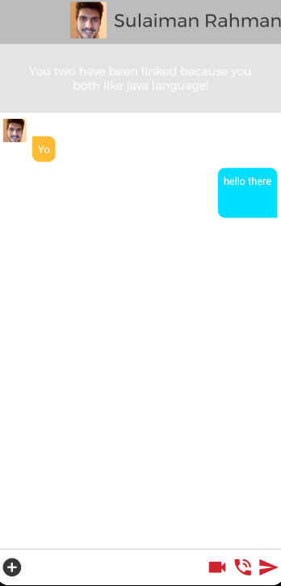
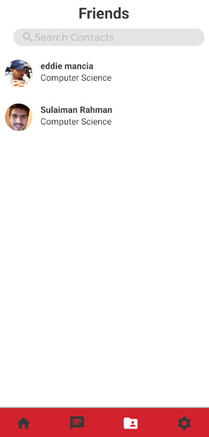
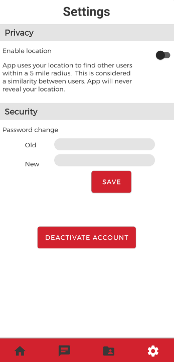

# MakeFriends
MakeFriends is a mobile Android app designed to help CSUN students meet and make new friends at CSUN.  The MakeFriends app allows the user to customize the user’s account profile by allowing the user to save a profile picture, biography description, a class schedule, and several interests to the user’s account.  The app also allows the user to search for another user that has similar interests, has the same class, or is within five miles.  After finding a person through the search feature, the user will then be able to communicate with that person through various ways such as sending text messages or doing audio calls.  Moreover, the app allows the user to manage conversations or friends.  The user will be able to delete, block, or keep conversations or friends.

Currently, the MakeFriends app is designed to be used by students of CSUN.  In other words, anyone with a CSUN student email account can use the app.  Unfortunately, the app is not designed in a way that lets non-students such as staff members of CSUN use the app.  However, although the MakeFriends app is fully ready for use, there are considerations to have future updates expand MakeFriends to allow staff members of CSUN or even people from other Cal State Universities use the app freely.

### Contributors

@eddiemm https://github.com/eddiemm

@JoshuaHuynh https://github.com/JoshuaHuynh

@nostalgia2021 https://github.com/nostalgia2021

@SulaimanRahman https://github.com/SulaimanRahman

### Demo

### Screenshots

_Sign Up Page_

 

_Home Page_

 

_Chat Page_

 

_Search Page (searching for strangers to connect with)_

 

_Conversation Page_

 

_Contacts Page_

 

_Settings Page_

